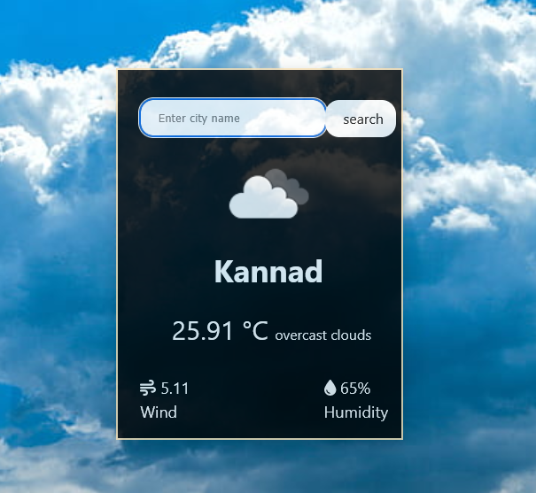

# 🌦️ React Weather App

A simple weather forecast application built with **React.js** that displays real-time weather data using the **OpenWeatherMap API**.

---

## 🔥 Features

- 🌐 Search weather by city name
- 🧠 Keyboard shortcuts:
  - Press `/` to focus input
  - Press `Enter` to search
- 🌡️ Temperature in Celsius
- 🌬️ Wind speed and 💧 Humidity display
- 🌥️ Weather icons and description
- ❗ Error handling and messages

---

## 📸 Preview


---

## 🚀 Getting Started

### 1. Clone the Repository

```bash
git clone https://github.com/your-username/react-weather-app.git
cd react-weather-app
